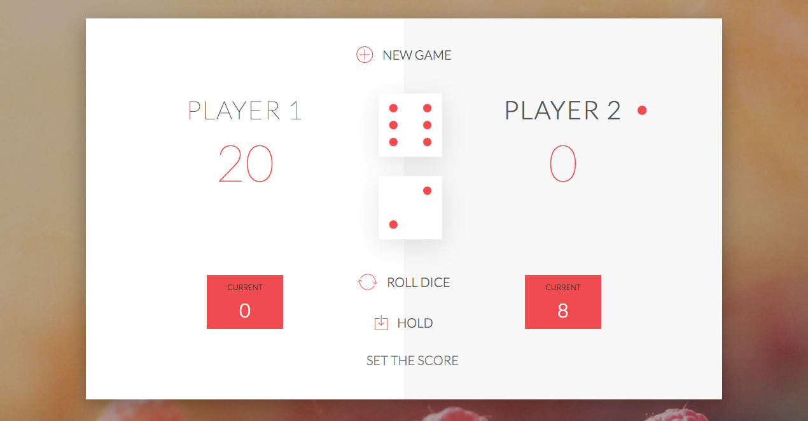

# Pig Game

GAME RULES:

- The game has 2 players, playing in rounds
- In each turn, a player rolls 2 dice as many times as he whishes. Each result get added to his ROUND score
- BUT, if the player rolls a 1, all his ROUND score gets lost. After that, it's the next player's turn
- ALSO if the player rolls 6's on a sequence (gets one 6 and then another one on the next roll) BOTH SCORES are LOST and it's the next player's turn
- The player can choose to 'Hold', which means that his ROUND score gets added to his GLOBAL score. After that, it's the next player's turn
- The first player to reach 100 points on GLOBAL score wins the game

